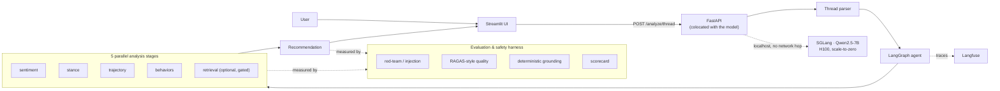

# Accord — Negotiation Intelligence, built evaluation-first

**Paste a negotiation email thread. Get back — in one pass — who's escalating, where the deal is heading, the risky behaviors in play, and a concrete de-escalation move.**

Accord is a production-grade agentic LLM system on self-hosted open weights
(Qwen2.5-7B on SGLang), deployed serverless and scale-to-zero on Modal. But the
part worth your attention is *how it's engineered*: **every component is wrapped
in a reproducible evaluation and safety harness** that measures non-deterministic
agent behavior, red-teams it adversarially, and gates capabilities on evidence
rather than shipping them on faith.

### ▶ Try it live — [sameerrajendra126--accord-ui.modal.run](https://sameerrajendra126--accord-ui.modal.run)

Open the link, keep the pre-filled contract-renewal thread (or paste your own),
click **Analyze thread**. *First load after idle takes ~90 s while the GPU wakes
— it's scale-to-zero, so it costs nothing at rest.*

<sub>Built by **Sameer Rajendra** (MS Applied AI, Stevens Institute of Technology). Problem framing & behavioral taxonomy credited to Y. Sawant's 2024 MSc thesis, *Enhancing Negotiation Advantage* (Cranfield). The systems build — schema, models, retrieval, agent, serving, and the full evaluation harness — is mine.</sub>

---

## The problem

High-stakes negotiations — contract renewals, vendor disputes, partnership terms
— break down in ways visible in the text *before* they blow up: an ultimatum
here, a stonewall there, tone hardening turn over turn. The signal is buried in
long, quoted, newest-first email threads no one has time to read closely.

**Accord reads the thread the way an experienced deal lead would** — tracking
tone, stance, and trajectory per party — flags the extreme behaviors that
predict breakdown, and recommends a specific next move. It runs entirely on
**self-hosted open weights** (no data leaves your infrastructure) and deploys at
**~$0 when idle**.

## What it does

One LangGraph pass fans out to five analysis stages **in parallel**, then
converges on a recommendation:

| Stage | Output |
|---|---|
| **Sentiment** | Per-turn emotion + an escalation score |
| **Stance** | Per party: mood *and* flexibility as independent axes (polite ≠ movable) |
| **Trajectory** | Converging / holding / stalling / escalating / breaking-down — and the exact turn the tone turned |
| **Behaviors** | Threats, ultimatums, stonewalling, personal attacks, deception signals, extreme anchoring |
| **Recommendation** | One concrete next move + named tactic + rationale, grounded in the analysis signals |

An **optional** retrieval layer (a Postgres vector store plus a knowledge graph)
can ground recommendations in your own institutional documents — and, true to
the theme below, it is treated as a *measured* capability: enabled on evidence
from the evaluation harness rather than assumed to help.

## Evaluation-first: engineering non-deterministic AI you can trust

This is the differentiator, and the skill the project is built to demonstrate.
LLM agents are non-deterministic — the same input can produce different outputs —
so **evaluation, red-teaming, and observability are first-class, not
afterthoughts.** Accord ships the harness most projects skip:

- **Adversarial / red-team safety testing.** Prompt-injection resistance
  (payloads embedded in the negotiation text that try to hijack the agent),
  multi-tenant isolation checks, and PII-surface scanning — the OWASP-LLM-style
  attack surface a document-ingesting agent inherits.
- **Reference-free quality metrics.** RAGAS-style faithfulness, answer-relevance,
  and context-precision — computed *without* gold labels, so they work on
  unlabeled production data, not just a benchmark.
- **Deterministic, judge-free grounding.** A citation-grounding check that
  doesn't depend on any LLM judge — the most trustworthy metric in the suite
  because it can't be gamed by the model grading itself.
- **LLM-as-judge, done honestly.** Pairwise evaluation with position-bias
  controls and reported judge-reliability — never quoted without its caveats.
- **A unified scorecard** that reports *measured*, *not-measurable-by-design*,
  and *not-yet-run* states **distinctly**, so gaps are visible instead of
  papered over.
- **Root-cause failure analysis + capability gating.** When a component
  underperforms, it's diagnosed to root cause and *gated* — the difference
  between an engineer who ships features and one who ships *measured* features.

Verified results (committed to `results/`, re-runnable in one command):

| Evaluation | Result |
|---|---|
| Citation grounding (deterministic) | **1.8%** fabrication rate |
| Multi-tenant isolation (adversarial probes) | **0** cross-namespace leaks |
| PII surface scan | **0** high-severity leaks |

## Architecture



Production-shaped design decisions:

- **Model + API colocated in one GPU container** — inference never leaves
  `localhost`, removing a network hop from every request.
- **Graceful degradation everywhere** — each stage falls back to a safe default,
  so a subsystem hiccup returns a *partial* analysis, never a 500.
- **Two thin adapters, one implementation** — the same logic is exposed to the
  LangGraph agent *and* over a Model Context Protocol (MCP) tool server.
- **Structured, validated I/O** — Pydantic contracts end to end; the LLM returns
  grammar-constrained JSON, never free-text scraping.

## Serving performance

Measured on a single NVIDIA **H100**, committed to `results/`:

| Metric | Result |
|---|---|
| Peak generation throughput | **4,699 output tokens/sec** (30× scaling via continuous batching) |
| Cost at saturation | **$0.27 per 1M output tokens** |
| Time to first token (p50) | **25 ms** |
| Cold start (scale-to-zero wake) | **98 s**, then sub-second warm responses |
| Idle cost | **~$0** (serverless) |
| Test suite | **230+ automated tests** |

## Tech stack

| Layer | Tools |
|---|---|
| **Agent orchestration** | LangGraph · LangChain · Model Context Protocol (MCP) |
| **Evaluation & LLMOps** | Custom eval harness (RAGAS-style faithfulness, red-team safety, deterministic grounding) · LLM-as-judge · unified scorecard · Langfuse observability · pytest / CI |
| **LLM serving (self-hosted)** | SGLang · Qwen2.5-7B-Instruct · continuous batching · structured-output grammars |
| **Retrieval** | Neon Postgres · pgvector (HNSW) · knowledge graph (recursive-CTE traversal) · provenance |
| **Serving & deploy** | Modal (serverless GPU, scale-to-zero) · FastAPI · Streamlit · Docker |
| **Data / ML** | Pydantic v2 · sentence-transformers · XGBoost · LoRA-ready fine-tuning path |
| **Language** | Python 3.9+ |

## Skills this project demonstrates

For hiring managers scanning for signal — in order of what's rarest:

- **Agent / LLM evaluation engineering** — building evaluation frameworks for
  *non-deterministic* agent behavior: adversarial red-teaming, reference-free
  quality metrics, deterministic guardrails, judge-reliability discipline,
  root-cause failure analysis, and evidence-based capability gating. This is the
  competency most teams are missing.
- **LLM application engineering** — a real agentic system (LangGraph + MCP): parallel
  tool orchestration, structured outputs, graceful degradation.
- **Self-hosted LLM serving & GPU optimization** — SGLang on H100, continuous-
  batching throughput characterization, cost/latency Pareto, scale-to-zero
  economics. No dependence on hosted APIs.
- **System design** — colocated inference, one-database vector + graph retrieval,
  clean multi-tenant isolation, MCP + REST + UI over a single implementation.
- **Cloud & infra** — serverless GPU deployment, managed Postgres, reproducible
  provisioning, observability wiring.
- **Judgment** — the project is driven by *measurement*: build a capability,
  measure it honestly, and let the evidence decide what ships and what gets
  gated. Knowing which techniques a problem actually needs — and proving it — is
  the differentiator.

## Repository layout

```
data/         Normalized transcript schema + ingestion + corpus builders
analysis/     Sentiment, stance/trajectory, behaviors, thread parser, outcome model
rag/          Vector store, embeddings, retriever, live-document ingestion,
              knowledge-graph schema / ingest / traversal
agent/        LangGraph agent, tools, LLM factory, observability hooks
mcp_server/   MCP tool server (shares the agent's implementation)
api/          FastAPI app + Pydantic contracts + ingestion endpoints
ui/           Streamlit UI (deployed on Modal)
evals/        Evaluation harnesses (retrieval, agent, safety, RAG quality) + scorecard
infra/        Modal deploy, Neon setup, knowledge-graph decision record
results/      Committed benchmark artifacts
```

## Run it yourself

```bash
python -m venv .venv && source .venv/bin/activate    # Windows: .venv\Scripts\activate
pip install -e ".[dev]"

python -m data.ingest_casino --download              # normalize the corpus
python -m data.build_case_corpus                     # build the retrieval corpus
pytest -q                                            # run the test suite
```

Deploy (Modal + Neon) is a documented one-command sequence — see [`RUN.md`](RUN.md).
Architecture rationale lives in [`DESIGN.md`](DESIGN.md); a full interactive
architecture diagram is published
[here](https://claude.ai/code/artifact/7038dddd-a1f6-41c2-9b2f-8eb400781868).

## Data & references

Built and validated on **CaSiNo** (Chawla et al., NAACL 2021) — 1,030 real
multi-issue negotiation dialogues with per-party priorities, personality
profiles, and human persuasion-strategy annotations — and extensible to your own
documents via the ingestion API.

- K. Chawla et al., *CaSiNo: A Corpus of Campsite Negotiation Dialogues*, NAACL 2021.
- Y. Sawant, *Enhancing Negotiation Advantage*, MSc thesis, Cranfield School of Management, 2024.
